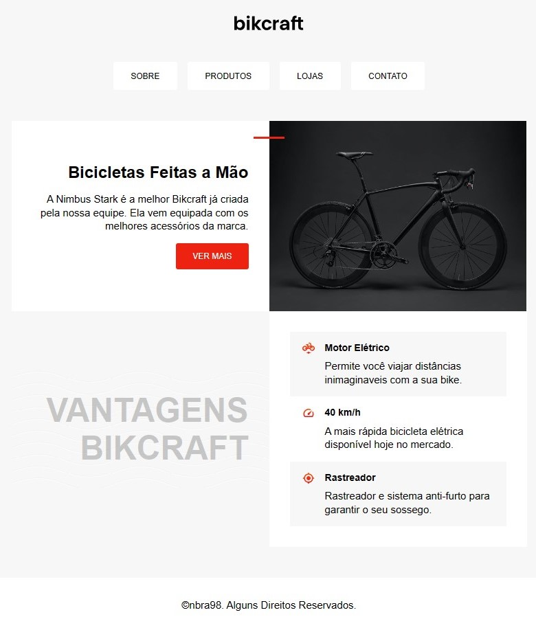

<h1 align="center">Landing Page Bikcraft 🌐</h1>

<h2 align="center">Meu 5º projeto em Desenvolvimento Front-End ​​💻​​</h2> 

 

<h2 align="center">Sobre 📑</h2>

Primeira landing page desenvolvida do zero, com base em um curso da Origamid (HTML e CSS para Iniciantes). O site apresenta uma bicicleta revolucionária, com todas as suas características sendo apresentadas em blocos, estilizados através diversas propriedades de CSS.
 

<h2 align="center">Tecnologias ​⌨️ ​</h2>

HTML e CSS
 

<h2 align="center">Para acessar ​🔗️</h2>

<a href="https://​nbra98.github.io/simple-landing-page-bikcraft/">Clique aqui</a>
  

